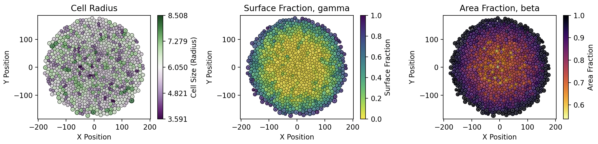
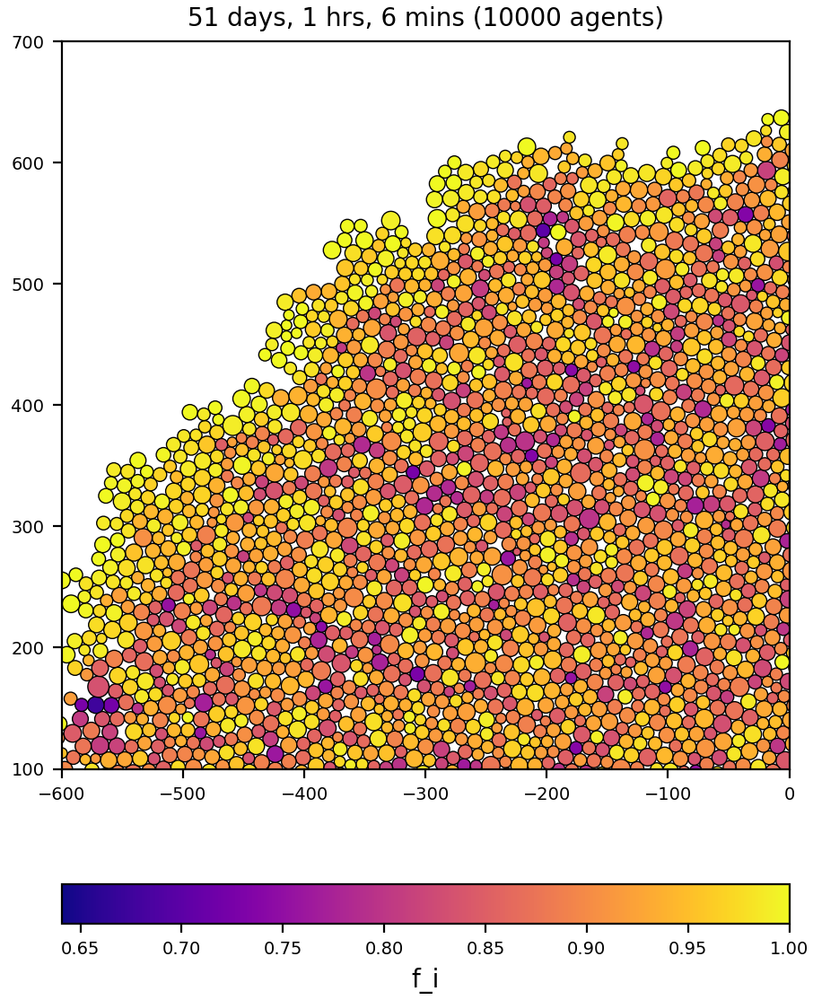
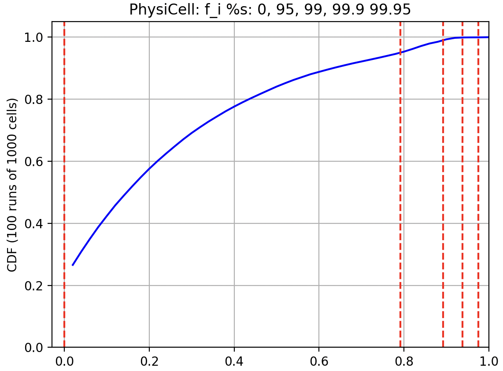
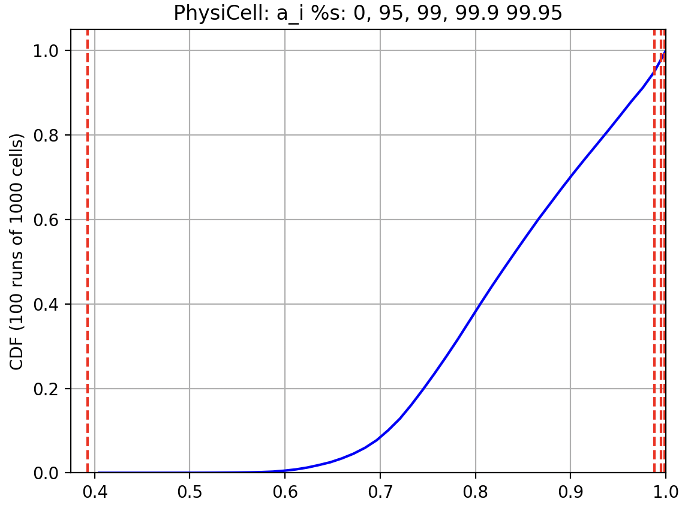

# Monolayer Growth with PhysiCell

This repository provides a PhysiCell model and simulation results for a growing (2D) monolayer. This is one "reference model" in the [OpenVT] (https://www.openvt.org/) project. This project has distinct, but related, sub-projects:
<ul>
  <li>11 cells, simple relaxation</li>
  <li>21 cells: 11+10 simple relaxation</li>
  <li>1000 cell monolayer, no contact inhibition</li>
  <li>10000 cell monolayer, 5x5 phase diagram of gamma, beta thresholds for contact inhibition</li>
</ul>

## 11 and 21 cells, simple relaxation

In a simple model leading up to the monolayer model, we have 11 cells along the x-axis. Each cell overlaps its neighbor by a radius length (R=5) at t=0 and then the model undergoes its normal relaxation (repulsion only, there's no cell-cell adhesion).

See https://github.com/rheiland/mechanics_relaxation

The time to reach 90% relaxed width will represent a cell cycle duration (when cell division would occur). However, based on early results, we eventually chose to use 5x this duration time.

We also added 5 additional cells to each end of the 11 cells, for a total of 21 cells, and compared the relaxation mechanics, of both the inner 11 cells and the outer 21, with other modeling frameworks.

## 1000 cells, no contact inhibition

Terminology:
* gamma - fraction of a cell's surface that is free (not in contact with neighbor cells)
* beta - fraction of a cell's area that is free (not overlapping with neighbor cells)

For this part of the project, we ran 100 replicates of a growing monolayer, with no contact inhibition, up to 1000 cells. We then generate a probability density function and cumulative density function for both gamma and beta.

(Thanks to Dr. Domenic Germano (@DGermano8) for the nice plotting scripts!)

## 10000 cells, max contact inhibition

Zoomed ROI of the 10K cells monolayer, coloring by `f_i` (fraction of free cell surface), using gamma and beta thresholds = 1.0 (max for each). Note that daughter cells have stochastic growth since each acquires a doubling area size of `A = A_0 *  N(2, 0.4)` (normal random distribution).

## 5x5 phase diagram for f_i, a_i values

Once we have the CDF for both gamma and beta, we choose fixed percentiles to map back to actual values that will be used as thresholds in the 10K cell monolayer simulations.

  

## PhysiCell release

This version came from the "mech_grid_xml" branch of PhysiCell 1.14.2, so we could easily modify and experiment with PhysiCell's mechanics voxel size. As it turned out, we did not end up using this feature. However, we did include some other PRs for post-1.14.2.

## Funding

National Science Foundation 2303695 and National Cancer Institute 1U24CA284156-01A1
