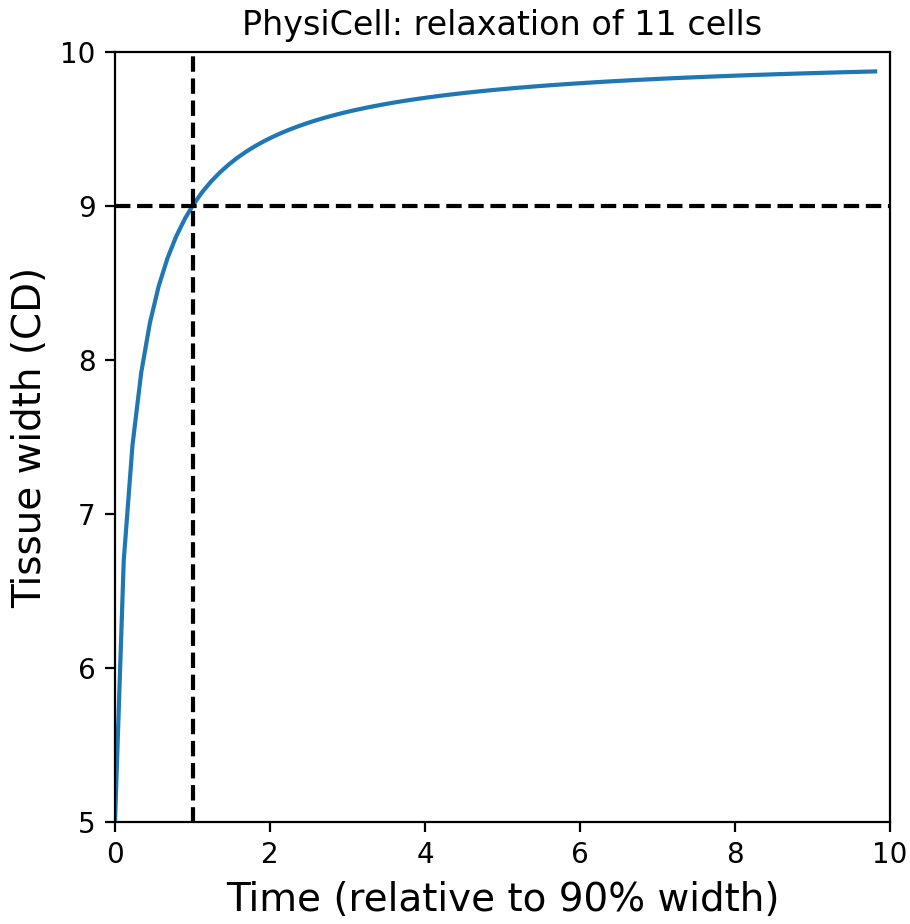
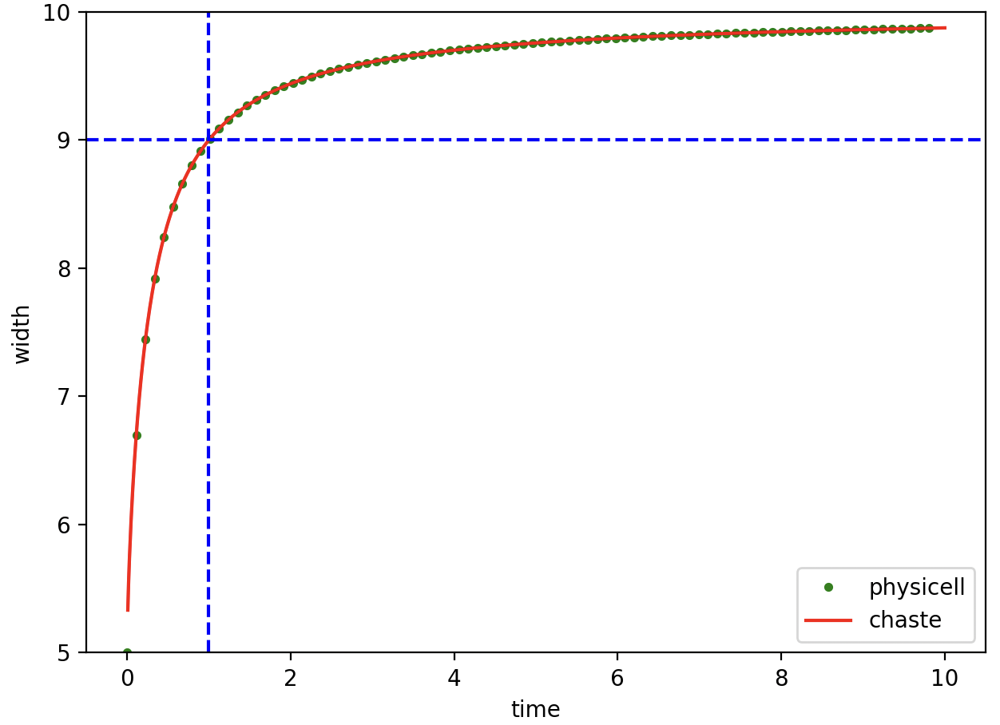
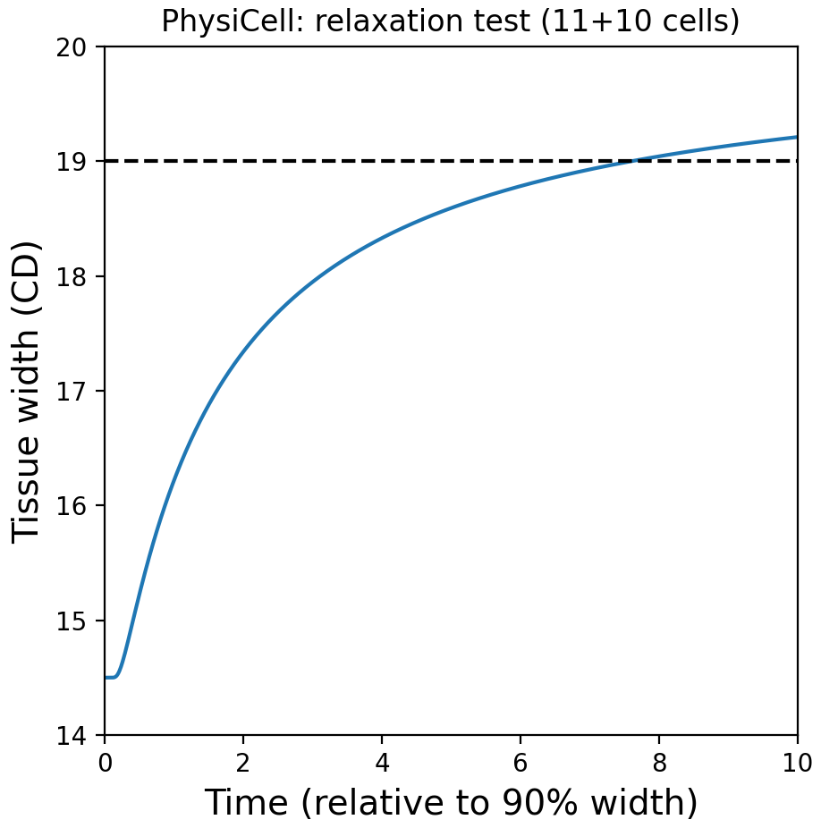
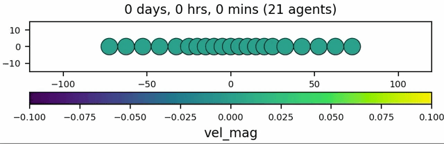
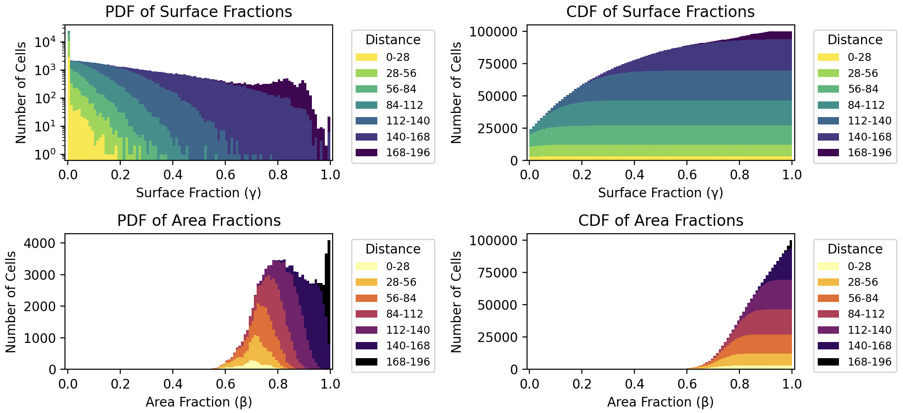
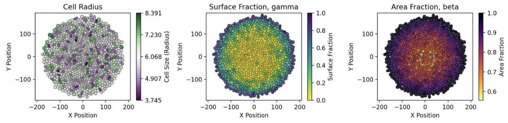
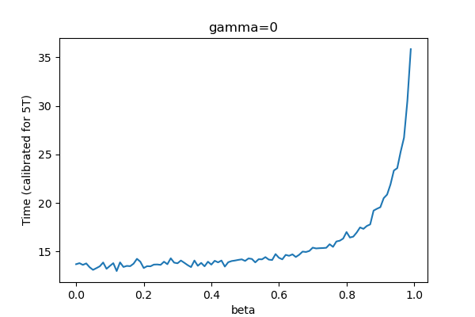
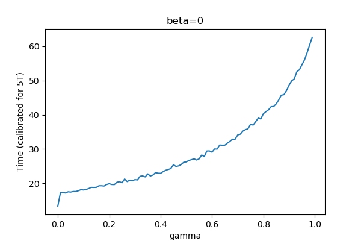
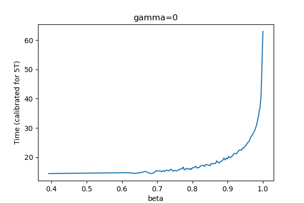
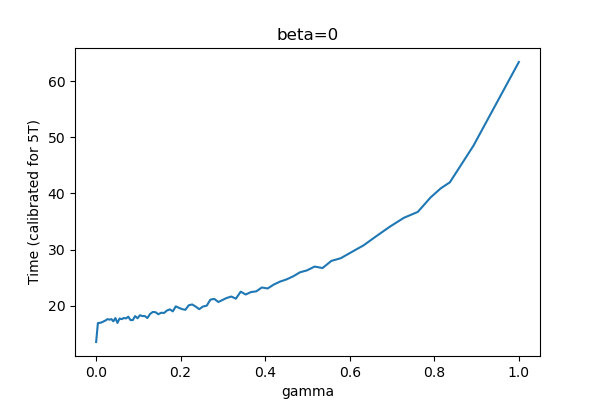

# Agent-based model of a growing monolayer using PhysiCell

This repository provides a PhysiCell model and simulation results for a growing (2D) monolayer. This is one "reference model" in the [OpenVT](https://www.openvt.org/) project. This project has distinct, but related, sub-projects:
<ul>
  <li>11 overlapping, horizontally aligned cells, undergoing mechanical relaxation</li>
  <li>21 cells: 11+10 undergoing relaxation</li>
  <li>a growing monolayer of 1000 cells (100 runs), with no contact inhibition on growth</li>
  <li>a growing monolayer of 10000 cells, with contact inhibition on growth, based on two computed values</li>
  <ul>
    <li>gamma: percentage of a cell's free boundary</li>
    <li>beta: percentage of a cell's free area</li>
  </ul>
</ul>

## Simple mechanical relaxation

### 11 and 21 cells, simple relaxation

In a simple model leading up to the monolayer model, we have 11 cells along the x-axis. Each cell overlaps its neighbor by a radius length (R=5) at t=0 and then the model undergoes its normal tion (repulsion only, there's no cell-cell adhesion).

The time to reach 90% relaxed width will represent a cell cycle duration (when cell division would occur). However, based on early results, we eventually chose to use 5x this duration time.

```
$ make load PROJ=cells11_final
$ make 
$ project  
or:
$ pcstudio   # if you have an alias for PhysiCell Studio

$ python analysis/plot_11cells_crop.py 88
(generates pc_plot_11cells.csv)
```


```
- assuming we have similar results from the Chaste ABM framework:
$ python analysis/plot_11cells_csv.py pc_plot_11cells.csv
```


<hr>
We also added 5 additional cells to each end of the 11 cells, for a total of 21 cells, and compared the relaxation mechanics, of both the inner 11 cells and the outer 21, with other modeling frameworks.

```
(base) M1P~/git/PhysiCell_monolayer$ python analysis/plot_21cells_crop.py 1440
(generates pc_plot_21cells_width.csv)
```




<hr>

## Replicates for 1000 cells with no contact inhibition

Terminology:
* gamma - fraction of a cell's surface that is free (not overlapping with neighbor cells)
* beta - fraction of a cell's area that is free (not overlapping with neighbor cells)

For this part of the project, we ran 100 replicates of a growing monolayer, with no contact inhibition, up to 1000 cells. We then generate a probability density function and cumulative density function for both gamma and beta.



(Thanks to Dr. Domenic Germano (@DGermano8) for the nice plotting scripts!)

## Time to reach for 10000 cells for varying gamma, beta
### gamma, beta from absolute range [0.0, 1.0]


[gamma_time_10K.csv](results/gamma_time_10K.csv), [beta_time_10K.csv](results/beta_time_10K.csv)

### gamma, beta from percentiles



## 10000 cells with contact inhibition


Zoomed ROI of the 10K cells monolayer, coloring by `f_i` (fraction of free cell surface), using gamma and beta thresholds = 1.0 (max for each). Note that daughter cells have stochastic growth since each acquires a doubling area size of `A = A_0 *  N(2, 0.4)` (normal random distribution).

### 5x5 phase diagram for f_i, a_i values

Once we have the CDF for both gamma and beta, we choose fixed percentiles to map back to actual values that will be used as thresholds in the 10K cell monolayer simulations.

  

These percentiles map into the following gamma and beta thresholds that will be used to compute the 5x5 phase diagram:
```
gamma_vals=  [0.0, 0.791, 0.893, 0.937, 0.975]
beta_vals=  [0.0, 0.988, 0.995, 0.999, 1.0]
```

## PhysiCell version

The base version of PhysiCell used for this model was 1.14.2, but it also included some modifications in pull requests, plus exposing a private variable in one class. 

## Funding

National Science Foundation 2303695 and National Cancer Institute 1U24CA284156-01A1
